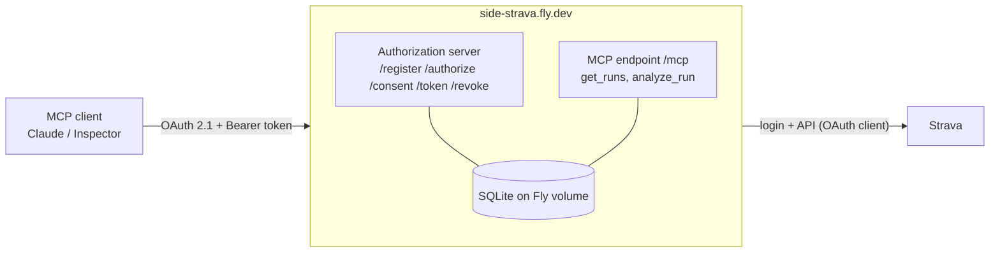

# strava-mcp

A remote [MCP](https://modelcontextprotocol.io) server that lets Claude (or any MCP client) read and analyse your Strava runs. It acts as its **own OAuth 2.1 authorization server**, with Strava as the login, and runs as an HTTP service on Fly.io.

- **Tools:** list runs by date range with pagination, plus a per-run analysis (pacing, splits, interval detection, pace and elevation profile)
- **Auth:** dynamic client registration, PKCE, a consent page, rotating refresh tokens, audience-bound tokens, hashed token storage
- **Design:** ports and adapters (swappable storage and auth provider), composition root, contract tests

Design write-up: **[notes.md](notes.md)** covers the design principles, the auth model and the confused deputy problem.

## Tools

| Tool | What it returns |
|---|---|
| `get_runs(start_date?, end_date?, limit=20, cursor?)` | Runs newest first, optionally within local dates (`YYYY-MM-DD`, inclusive). Pages with a cursor; each page ends with the next cursor or "End of results". No arguments = your latest runs. |
| `analyze_run(activity_id)` | One run in detail: summary, half splits and pace variability, km splits, laps, best efforts, auto-detected work/easy segments with a rep summary, and a pace and elevation profile (at most ~70 rows). |

Ask Claude things like *"Chart my monthly running volume for 2025"* or *"Analyse my last interval session"*.

## Architecture



```
server.py           MCP layer + composition root (tools, routes, /health, log redaction)
auth/
  ports.py          interfaces: OAuthStore, StravaTokenStore, StravaCredentials
  settings.py       BASE_URL, DATABASE_URL, AUTH_MODE from the environment
  factory.py        build_auth(settings): the one place concrete classes are chosen
  embedded/         our OAuth server: provider, consent page, Strava callback, credentials, policy
  stores/           storage backends selected by URL (sqlite:///…); SqliteStore
  external/         Descope / Keycloak mode: defined, not implemented yet
strava/             pure Strava client: api, oauth, runs (date filters/cursor), analysis, report
tests/              OAuth flow and attacks, consent page, store contract, analysis, paging
```

## How auth works (short version)

1. The client registers itself (`/register`); its redirect URI must be loopback or Claude's callback.
2. `/authorize` (with PKCE) leads to **our consent page**, which shows *which client* is asking and *where you'll be sent back*.
3. Approve → Strava login → `/strava/callback` stores your Strava tokens under your athlete ID and issues **our** code.
4. The client swaps the code for an access token (1 h) and a refresh token (30 d, rotated on each use).
5. Every `/mcp` request carries the token. The server maps it to the athlete and uses that athlete's Strava token. **Clients never see Strava tokens.**

Details and threat model: [notes.md](notes.md).

## Run locally

Requires [uv](https://docs.astral.sh/uv/) (it installs Python 3.12 and the dependencies).

1. **Strava app:** at <https://www.strava.com/settings/api>, create an app and set the *Authorization Callback Domain* to `127.0.0.1`.
2. **Configure:**
   ```sh
   cp .env.example .env      # fill in STRAVA_CLIENT_ID / STRAVA_CLIENT_SECRET
   uv sync
   ```
3. **Start:** `uv run server.py`. The server listens on `http://127.0.0.1:8000/mcp`.
4. **Connect a client.** It runs the OAuth flow in your browser:
   - **MCP Inspector:** `npx @modelcontextprotocol/inspector` → Streamable HTTP → `http://127.0.0.1:8000/mcp` → *Guided OAuth Flow*
   - **Claude Code:** `claude mcp add --transport http strava http://127.0.0.1:8000/mcp`, then `/mcp` → Authenticate
   - **Claude Desktop:** in `claude_desktop_config.json`:
     ```json
     "strava": { "command": "/full/path/to/npx", "args": ["-y", "mcp-remote", "http://127.0.0.1:8000/mcp"] }
     ```

claude.ai *custom connectors* connect from Anthropic's cloud, so they need the public deployment below.

## Deploy to Fly.io

`fly.toml` and the `Dockerfile` are included (app `side-strava`, region `sin`, SQLite on a volume at `/data`).

```sh
fly apps create side-strava
fly volumes create data --size 1 --region sin -a side-strava
grep '^STRAVA_' .env | fly secrets import -a side-strava
fly deploy
curl https://side-strava.fly.dev/health          # → ok
```

Then set the Strava *Authorization Callback Domain* to `side-strava.fly.dev`, and in claude.ai go to **Settings → Connectors → Add custom connector** → `https://side-strava.fly.dev/mcp`.

Stop with `fly scale count 0 -a side-strava` (keeps the data); resume with `fly scale count 1 -a side-strava`.

## Configuration

| Variable | Default | Purpose |
|---|---|---|
| `STRAVA_CLIENT_ID`, `STRAVA_CLIENT_SECRET` | — (required) | Strava app credentials. Secrets on Fly, `.env` locally |
| `BASE_URL` | `http://127.0.0.1:8000` | Public URL; issuer, `/mcp` resource and Strava callback all derive from it |
| `DATABASE_URL` | `sqlite:///store.db` | Storage backend (`sqlite:////data/store.db` on Fly) |
| `AUTH_MODE` | `embedded` | `external` (Descope/Keycloak) is defined but not implemented |
| `HOST`, `PORT` | `127.0.0.1`, `8000` | Bind address (`0.0.0.0` in the container) |

## Tests

```sh
uv run pytest
```

They cover: the full OAuth Connect flow in-process with Strava faked, PKCE and replay failures, refresh rotation, revocation, the consent page (CSRF, escaping, skip attempts, state rotation), the redirect allowlist, the audience check, DNS-rebinding protection, store contract tests (including a 20-thread race on single-use codes), Strava paging and date windows, and log redaction.

## Security notes

- Only SHA-256 hashes of our codes and tokens are stored. Strava tokens are stored as-is (encryption at rest is on the backlog).
- Query strings are redacted from access logs (OAuth codes and states live in URLs).
- The consent page has CSRF protection (form token + `SameSite=Strict` cookie), escaped output, a strict CSP and anti-framing headers.

## Limitations and backlog

- **Strava API Policy §5.3** (effective 2026-06-01) forbids using Strava data in AI applications (including context windows), except through Strava's own MCP. This project is a personal and portfolio build; inviting other users would need an AI-permitted data source.
- Backlog: rate limiting, Strava token encryption, disconnect + Strava deauthorization webhook, 429 backoff and caching, CI.
