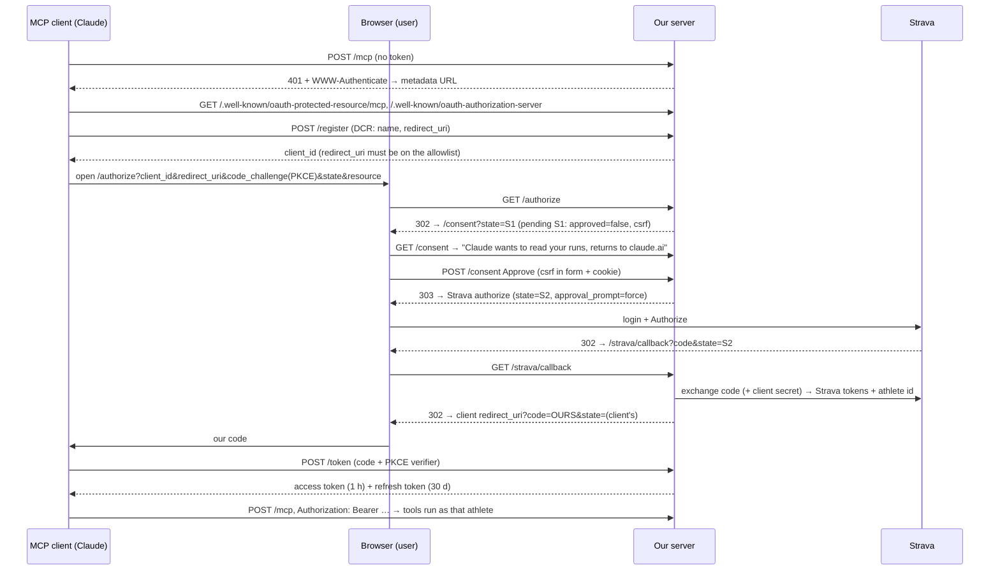

# Strava MCP Server: Design Notes

A remote MCP server that lets Claude read a user's Strava runs. It runs as an HTTP service on Fly.io, acts as its **own OAuth 2.1 authorization server**, and delegates user login to Strava.

```
 MCP client (Claude)                 Our server (side-strava.fly.dev)                    Strava
 ───────────────────                 ────────────────────────────────                    ──────
   /mcp + Bearer token  ──────►  resource server: tools get_runs, analyze_run
   OAuth (DCR, PKCE)    ──────►  authorization server: /register /authorize /consent /token /revoke
                                 OAuth client of Strava: /strava/callback, token refresh ──────►  API
                                 SQLite on a Fly volume: clients, codes, tokens, Strava tokens
```

---

## 1. Design principles used

| Principle | Where it shows up |
|---|---|
| **Separation of concerns** | `strava/`: a pure Strava API client plus analysis (no MCP, no storage). `auth/`: who may call the server. `server.py`: the MCP layer and composition root only. |
| **Dependency inversion (ports and adapters)** | Code depends on interfaces in `auth/ports.py` (`OAuthStore`, `StravaTokenStore`, `StravaCredentials`), written as `typing.Protocol`, never on `sqlite3` or a vendor SDK directly. |
| **Interface segregation** | Three small ports rather than one large one. External auth mode would need only `StravaCredentials`, not our OAuth tables. |
| **Open/closed** | A new database is a new class plus one branch in `open_store(url)`. A new auth provider is a new branch in `build_auth()`. Neither changes the tools or the provider. |
| **Composition root** | Concrete classes are chosen in one place: `auth/factory.py::build_auth(settings)`, called from `server.py::create_server(settings)`. Nothing is created at import time, so tests can build a server against a temporary database. |
| **Policy separated from mechanism** | `auth/embedded/policy.py` holds the decisions (TTLs, scopes, token format, redirect allowlist). `auth/stores/` holds only persistence guarantees (hashing, expiry, atomic consumption). Every backend follows the same policy. |
| **Use the framework's seams** | Embedded mode implements the SDK's `OAuthAuthorizationServerProvider`. External mode (Descope/Keycloak) will implement the SDK's `TokenVerifier`. No home-made auth framework. |
| **Pure functions for logic** | `strava/analysis.py`, `runs.py` and `formatting.py` take data in and return data out, with no I/O. They're easy to test with real recorded runs. |
| **Statelessness** | Pagination uses a cursor (the last run's start time), so the server keeps no session state. `strava/oauth.py` makes HTTP calls only; callers decide where tokens are stored. |
| **Laziness** | `iter_activities()` is a generator: Strava's page 2 is only requested if it's needed. |
| **Configuration from the environment (12-factor)** | `BASE_URL`, `DATABASE_URL`, `AUTH_MODE`, `HOST`/`PORT`. Every URL derives from `BASE_URL`, so moving from localhost to Fly is configuration only. |
| **Secure by default** | Hashed tokens, single-use codes, audience binding, DNS-rebinding protection, forced consent, and a strict CSP on the consent page. |
| **Contract tests** | `tests/test_store_contract.py` is written against the `Store` protocol and parametrised by backend. A future `PostgresStore` must pass the same tests unchanged. |
| **YAGNI with room to grow** | External auth mode is *defined* (stub classes with "to implement" notes) but not built. SQLite now; Postgres when there's more than one instance. |
| **MCP tool design** | Tools return computed, compact summaries (splits, segments, pace profile), not raw API dumps. The server does the deterministic maths; the model interprets the results. |

---

## 2. Authentication and authorization

### Three relationships

| # | Relationship | Our role | Tokens |
|---|---|---|---|
| ① | MCP client ↔ our server | **OAuth 2.1 authorization server + resource server** | Ours: access token (1 h), refresh token (30 d) |
| ② | User identity | **Delegated to Strava**: no passwords or accounts of our own | The Strava athlete ID becomes the token's `subject` |
| ③ | Our server ↔ Strava | **OAuth 2.0 client** (one Strava app for all users) | Strava's, stored per athlete, refreshed automatically |

The MCP client **never sees Strava tokens** (no token passthrough). Our server maps *our token → athlete ID → that athlete's Strava token*.

### The Connect flow



### Who does what

| Concern | Handled by |
|---|---|
| Endpoints, metadata documents, PKCE verification, `redirect_uri` matching, code expiry, refresh scope narrowing | MCP Python SDK |
| Registration policy, consent, Strava hand-off, token minting and rotation, storage | Our code (`auth/embedded/`, `auth/stores/`) |

### Tokens and their lifetimes

| Item | Lifetime | Properties |
|---|---|---|
| Pending login (`state`) | 10 min | Single use, **rotated at consent** (S1 → S2), `approved` flag stored server-side |
| Authorization code | 5 min | Single use (`DELETE … RETURNING`, atomic), bound to client, athlete, PKCE challenge and redirect URI |
| Access token | 1 h | Opaque, 256 random bits, sent as `Bearer` on every `/mcp` request |
| Refresh token | 30 d | **Rotated on every use**. The old one is consumed atomically, and only the issuing client can use it |
| Strava tokens | set by Strava (about 6 h) | One row per athlete, refreshed 60 s before expiry under a per-athlete lock; Strava's rotated refresh token is always saved |

### Checks on every request and grant

- **Bearer token:** looked up by SHA-256 hash; unknown or expired gives 401.
- **Audience:** each token is bound to `https://side-strava.fly.dev/mcp` (RFC 8707 `resource`), and the SDK rejects tokens minted for another server (`validate_token_resource=True`).
- **Scope:** `runs:read` is required on `/mcp`. A refresh can narrow scopes but never widen them.
- **Client binding:** codes and refresh tokens work only for the client they were issued to.
- **Revocation:** `/revoke` deletes the token. Revoking a refresh token also kills that client's access tokens for the athlete.
- **Transport:** DNS-rebinding protection accepts only `127.0.0.1` / `localhost` or the host from `BASE_URL` (otherwise 421). TLS is terminated by Fly's proxy.
- **Logs:** query strings are redacted from access logs (`/strava/callback?[redacted]`), so OAuth codes and states never reach `fly logs`.
- **Strava permission:** if the user unticks "private activities" (`activity:read_all`), the Connect fails cleanly instead of half-working.

### Storage

- SQLite on a Fly volume, behind the `Store` protocol. **Only hashes** of codes and tokens are stored; SHA-256 is enough because they're random and high-entropy.
- Expiry is checked on every read. `cleanup_expired()` runs at startup.
- Single use is enforced with `DELETE … RETURNING` (a read-and-delete in one statement). This is tested with 20 threads racing for one code: exactly one wins.

### Auth modes

| Mode | Status | How it plugs in |
|---|---|---|
| `embedded` | ✅ Implemented | `MCPServer(auth_server_provider=EmbeddedAuthProvider, …)` |
| `external` (Descope / Keycloak) | Stubs only | `MCPServer(token_verifier=JwtTokenVerifier, …)`, and Strava tokens from the provider's vault (`DescopeStravaCredentials` / `KeycloakStravaCredentials`) |

---

## 3. The confused deputy problem

### Definition

A **deputy** is a program that holds authority and uses it on behalf of others. It's **confused** when it applies *one party's authority* to *another party's instructions*, because it can't tell who issued them.

**Bank analogy:** a teller's rule is "if the account owner is present and signs, do what the form says". A stranger hands you a form saying "transfer to account 999", you pass it to the teller and sign, and the money goes to the stranger. The authority was yours; the instructions were the stranger's.

### Why our architecture is exposed

Our server is an **OAuth proxy**: it sits in front of Strava using **one fixed Strava client ID**. Strava's consent screen always says *"Authorize Running Personal"* (our app). It never names the **MCP client** behind the request, and if the user approved before, Strava may approve silently.

### The attack

```
1. Attacker registers a client:   name="Claude", redirect_uri=https://attacker.com/steal
2. Attacker sends the victim a link: https://side-strava.fly.dev/authorize?client_id=<attacker>&...
3. Victim clicks → our server → Strava recognises the victim → approves (silently or by habit)
4. Our server issues a code to redirect_uri → attacker.com/steal
5. Attacker exchanges the code for a token → reads the victim's runs
```

**PKCE doesn't help here.** PKCE stops someone who *intercepts* a code. In this attack the attacker *started* the flow, so they hold the PKCE verifier themselves.

### Defences (layered)

| Layer | What it does | Breaks the attack at |
|---|---|---|
| **Redirect-URI allowlist** at registration | Only loopback addresses (Claude Code, `mcp-remote`, Inspector) and Claude's callback are accepted, so codes can't be sent to `attacker.com` | Step 1 |
| **`approval_prompt=force`** | Strava always shows its consent screen, so nothing is ever silent | Step 3 (partly: Strava still only names our app) |
| **Our consent page** (required by the MCP spec for proxy servers) | Shows *which client* is asking and *where you'll be sent back* before anything reaches Strava | Step 3 |
| **Server-side `approved` flag + state rotation** | The callback only accepts requests approved on our page. The page's state S1 is useless for skipping it; only S2, created by Approve, works | Skipping the consent page |
| **CSRF token (form + `SameSite=Strict` cookie)** | Another site can't auto-submit Approve in the victim's browser | Forged approval |
| **Escaping, strict CSP, `frame-ancestors 'none'`** | No script injection through client names; no clickjacking of the Approve button | Attacks on the consent page itself |

Each defence is covered by an automated test: foreign redirect URI refused, consent skipped (400), forged POST without the cookie (403), wrong CSRF token (403), `<script>` client name escaped, consent state rotated and single-use.

### Related attacks and their defences

| Attack | Defence |
|---|---|
| Stolen or replayed authorization code | PKCE + single-use codes |
| Token minted for another server | Audience binding (`resource`) |
| DNS rebinding (an attacker's domain pointed at our server) | Host-header allowlist (421) |
| Refresh-token theft or reuse | Rotation + single use + client binding |

---

## 4. Known gaps (production backlog)

- Rate limiting on `/register`, `/authorize`, `/consent`, `/token`; cleanup of unused client registrations.
- Encrypt Strava tokens at rest (key stored as a Fly secret).
- A disconnect command and Strava's deauthorization webhook (delete data when access is revoked).
- Handle Strava 429s with backoff and a short per-athlete cache (the rate quota is shared by all users).
- Git, CI (tests, ruff, pyright), deploys from CI, dependency auditing.
- **Product constraint:** Strava's API Policy (§5.3, effective 2026-06-01) forbids sending Strava data into AI context, except through Strava's own MCP. Multi-user use needs an AI-permitted data source (Intervals.icu, Garmin, or GPX/FIT uploads); the auth platform carries over unchanged.
